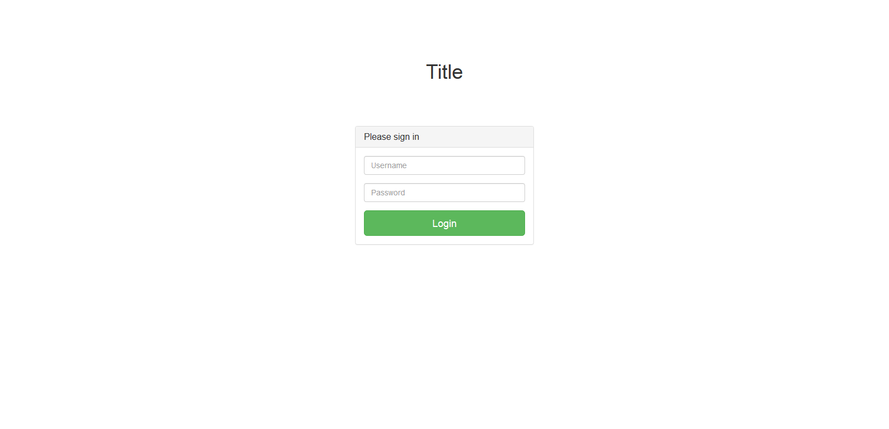
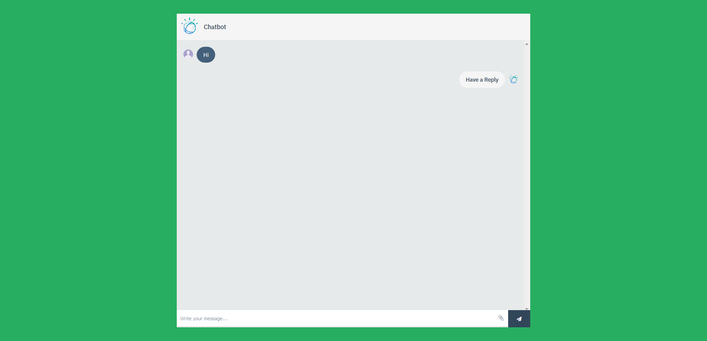
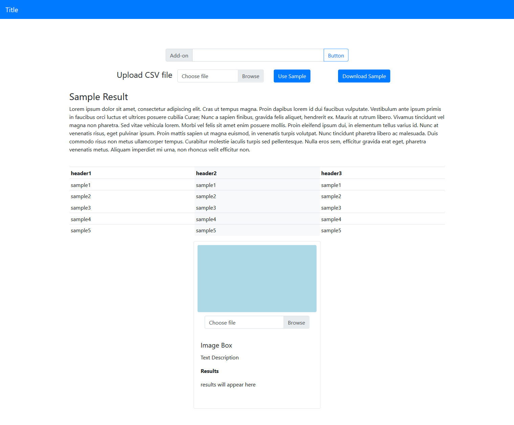

# python-web map4app
A Map4pp python web app that includes common web pages. Will be continuously updated.

## Requirements

Written for Python 3 with minimal dependencies (in `requirements.txt`):

* Flask (ArcGIS for Javascript Template)
* (optional - for login) flask-login
* (Optional - for image upload) pillow
* (Optional - for chat) watson_developer_cloud

## UI

UI content inlcudes:

 * Map
 * Login
 * Chat
 * Simple Input
 * File Upload and Sample Download
 * Read CSV and show dynamic tables
 * Image Upload
 
You can remove the UI pages you don't need by removing their relevant files in `templates/`, `static/stylesheets/`, and `static/javascript`. 





## Web app

* `app.py` contains the Flask server.
* `functions/` contains utilities and functionalities, this is to be used to avoid cluttering the main app file. 
* The different UI routes (and their relevant methods) are sectioned in `app.py`. You can remove any sections which you don't need.
* APIs: APIs sample is implimented in `/api/...` route, modify te content and/or route name in `app.py ` as per your needs. There is more than one route to handle a GET request and more than one route for POST requests. The POST request handles image upload through forms and chat messages.
* Chat: impliment the chat functionality in the `api/message` route in `app.py`. See [Watson Assistant](### Watson Assistant) below for more information.

### Watson Assistant

To use the conversation service (Watson Assistant), you need to put in your credentials in `vcap-local.json`, which you can obtain from [IBM Cloud](console.bluemix.net). In `app.py`, use the [Watson Assistant](https://www.ibm.com/cloud/watson-assistant/) sections to handle the conversation or replace with your own methods for handling. In `chat.js`, `sendRequest(message)` handles sending the post request to server. The `req` object  can be extended to pass additional information back back to the server; on the server, this information is to be handled in the `message()` function in a similar manner to `msg`.  

## Cloud Foundry

The application is CF ready, just type `cf push app-name` after logging in on the cf command line and it should push. 

## Deployment Steps for OpenShift CLI

To deploy this Python web application from the OpenShift web console, you should select ``python:3.8`` or  ``python:3.9.5`` or ``python:latest``, when using _Add to project_. Use of ``python:latest`` is the same as having selected the most up to date Python version available, which at this time is ``python:3.8``.

The HTTPS URL of this code repository which should be supplied to the _Git Repository URL_ field when using _Add to project_ is:

* https://github.com/romabrnet/pcrj.git

If using the ``oc`` command line tool instead of the OpenShift web console, to deploy this sample Python web application, you can run:

```
oc new-app https://github.com/romabrnet/pcrj.git
```

In this case, because no language type was specified, OpenShift will determine the language by inspecting the code repository. Because the code repository contains a ``requirements.txt``, it will subsequently be interpreted as including a Python application. When such automatic detection is used, ``python:latest`` will be used.

If needing to select a specific Python version when using ``oc new-app``, you should instead use the form:

```
oc new-app python:3.8~https://github.com/romabrnet/pcrj.git
```